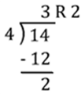

# 2.2 Expressions
## What is an Expression?
In programming, an **expression** is something that either is a value (number or other piece of data) or can be calculated to produce a value. The process of calculating an expression to produce its value is called **evaluating** the expression.
### Examples
* ```1```
* ```"Hello"```
* ```2 + 2```
* ```3 / 4```
* ```#9/7/2016#```
* ```True```
### To Try These Out
Start LINQPad, and, next to Language, select “VB Expression”. Then, you can type in any of these expressions and LINQPad will evaluate them for you and display the result when you press the Execute (▶) button.

## Literals
Literals are one category of expressions. A **literal** is a way of typing a value directly in the code of your program. Visual Basic includes a variety of literals that you can use. Here are some.

### Integer Literals
You can represent integers in Visual Basic in four different ways:
* Using just the plain integers (for example, ```0```, ```1```, ```-22```, ```47```, etc.)
* Using hexadecimal with an ```&H``` prefix (for example, ```&H0```, ```&HC```, ```&HFF```, ```&H1A2D```, etc.)
* Using octal with an ```&O``` prefix (for example, ```&O0```, ```&O7```, ```&O377```, etc.)
* Using binary with an ```&B``` prefix (for example, ```&B110011```, etc.)
(Note that LINQPad always displays integers in decimal.)
You can also insert underscores (```_```) in your integer literals as place separators, like ```1_000_000``` or ```&B1100_1000```.

### Floating-point Literals
You can represent numbers with fractions in two different ways:
* Using just the number, including the decimal point (for example, ```1.5```, ```-3.14```, etc.)
* Using a form of scientific notation (for example, ```3.14E2``` – which equals 3.14×10²=314,\
```6.022E23``` – which equals 6.022×10²³,\
```4.752E-3``` – which equals 4.7523×10⁻³=0.004752)

### Text Literals
You can represent text by enclosing it in double-quotes (for example, ```"Hello, World!"```)

### Date Literals
You can represent dates and times by enclosing them in number signs. Two formats of date are accepted: month/day/year and year-month-day. Leading zeros are accepted but optional, but the year must be four digits. For example, ```#9/6/2017#```, ```#2017-9-6#```, and ```#2017-09-06#``` all represent September 6, 2017. Times can be written in 24-hour format or with AM or PM. For example, both ```#15:00#``` and ```#3:00 PM#``` can be used.

### Boolean Literals
Visual Basic does support Boolean logic, and you can represent true or false values using the keywords ```True``` and ```False```.

## Arithmetic Expressions
Arithmetic expressions let you perform arithmetic on the results of other expressions. Visual Basic includes several common arithmetic operators that you can use in simple calculations, as well as some other operators for other related uses. These operators do follow the standard order of operations (PEMDAS).

|Operator	|Description	    |Example	    |Evaluates To|
|-----------|-------------------|---------------|------------|
|```+```	|Addition	        |```2 + 2```	|```4```
|```-``` 	|Subtraction	    |```4 - 3```	|```1```
|```*```	|Multiplication	    |```4 * 4```	|```16```
|```/```	|Division	        |```14 / 4```	|```3.5```
|```\```	|Integer Division	|```14 \ 4```	|```3```
|```Mod```	|Modulus (remainder)|```14 Mod 4```	|```2```
|```^```	|Exponent	        |```2 ^ 8```	|```256```
|```<<```	|Bit shift left	    |```5 << 2```	|```20```
|```>>```	|Bit shift right	|```32 >> 3```	|```4``` 
|```&```	|Concatenation	    |```"2" & "2"```|```"22"```

The **integer division** and **modulus** operations are based on long division, which gives you two answers, a quotient and a remainder. Integer division gives you the quotient and modulus gives you the remainder.



The **bit shift** operators rearrange the bits of the binary form of an integer. Shifting a number 1 bit to the left acts like multiplying the number by 2. Shifting left 2 bits is like multiplying by 4, shifting left 3 bits like multiplying by 8, and so on. Shifting right 1 bit is like dividing the number by 2 (ignoring any remainder). Bit shifting is a little faster for the computer than normal multiplying and dividing, so some programmers use these operators to give their programs more speed. They are generally not necessary for the programs we will be writing in this class. 

The **concatenation** operator is used for combining two pieces of text together. (Also, if you give the + operator two pieces of text instead of two numbers, it may also act as a concatenation operator.)

### More Examples
|Example                    |Evaluates To|
|---------------------------|------------|
|```2 + (3 + 4)```          |```9```
|```5 * 6 + 5```            |```35```
|```"New" & " " & "York"``` |```"New York"```
|```3 ^ 2 + 4 ^ 2```        |```25```

## Comparison Expressions
Comparison expressions let you compare the results of other expressions. They work for many different kinds of values, but may have unexpected behavior.
|Operator	|Description	    |Example	    |Evaluates To|
|-----------|-------------------|---------------|------------|
|```<```	|Less Than	        |```2 < 2```	|```False```
|```>```	|Greater Than	    |```4 > 3```	|```True```
|```=```	|Equals	            |```4 = 4```	|```True```
|```<>```	|Is Not Equal	    |```2 <> 2```	|```False```
|```<=```	|Less Than or Equal	|```14 <= 4```	|```False```
|```>=```	|Greater Than or Equal	|```8 >= 2```	|```True```

For numbers, they should all work as you expect.

For dates, just think that “less than” means “earlier than”.

For text, it depends. By default, Visual Basic compares the Unicode character codes for each letter, until one of them is different. Since “A” is 65 and “a” is 97, this means that all of the uppercase letters are “less than” the lowercase letters. There is a setting than can change it so the operators treat upper and lowercase letters the same, but, for the most part, we will try to avoid using less than and greater than with text.

For true and false, let’s just use equals and not equals. <span style="color: darkgray">(If you must know, VB treats True like the number -1, which is all 1s in binary, and False like the number 0, so, in VB, True is less than False. This is a quirk of Visual Basic that you will not find in most other programming languages.)</span>

## Logical Expressions
Since we know Visual Basic includes Boolean values, it is only logical[¹](#footnote1) to assume that it also includes the logical operators. They work the way we learned them in Unit 1.

|Operator	|Description	    				|Example	    		|Evaluates To|
|-----------|-----------------------------------|-----------------------|------------|
|```And```	|True if both are true				|```True And True```	|```True```
|```Or```	|False if both are false			|```False Or True```	|```True```
|```Xor```	|True if they are different			|```True Xor True```	|```False```
|```Not```	|The opposite of the given false	|```Not True```			|```False```

<span style="color: darkgray">(You can also use these operators on integers. In that case, it takes the binary versions of each number, and performs the Boolean operation for each bit of each number, so 6 Or 12 would be &B0110 or &B1100, combining to become &B1110, which is 14. This is an advanced use of these operators we will likely not get to in this class.)</span>

<span style="color: darkgray">(Also, if you really want to know, Visual Basic does have a defined order of operations for all of these operators. It goes like this: parentheses, exponent, negation, multiplication and division, integer division, modulus, addition and subtraction, concatenation, all the comparison operators, Not, And, Or, and finally Xor. Really, if you’re thinking about taking advantage of this, just use the parentheses. It’s not worth the headache trying to remember all this.[²](#footnote2))</span>

## Questions
Evaluate the following expressions:
1. ```24 + 56```
2. ```1.2 * 3 - 0.6```
3. ```34 * 4 < 111```
4. ```(3 ^ 2 + 4 ^ 2) ^ (1 / 2)```
5. ```2017 Mod 4 = 0```
6. ```True And (False Xor True)```
7. ```5 <= 10 And 10 <= 8```
8. ```"The answer is: " & (2 + 2)```
9. ```Not 15 > 5```
10. ```2 & 2 = 2 + 2 Or 2 & 2 = 2 * 2```

## Footnotes
¹ <a id="footnote1"></a> Pun entirely intended.\
² <a id="footnote2"></a> For an even fuller list, with kinds of expressions we may not get to in this class, you can check out the official documentation at https://msdn.microsoft.com/en-us/library/fw84t893.aspx.
