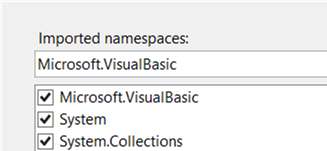

# 2.4 The `System.Console` Object

The `System.Console` object (or `Console` for short[¹](#footnote1)) contains commands and features for text-based programs. These programs usually run in a console window, with light colored monospaced text on a black background filling the entire window.

|Method	|Arguments	|What It Does|
|-------|-----------|------------|
|`Beep`	|2 Optional Integers	|If the arguments are omitted, plays a beep sound. If the arguments are included (both are necessary if you include one), plays a sound whose frequency is the first integer measured in Hertz for a duration as long as the second integer measured in milliseconds.
|`Clear`	|None	|(Does not work in LINQPad)<br>Clears everything displayed in the console window
|`ReadKey`	|1 Optional Boolean (True/False)	|(Does not work in LINQPad)<br>Waits for the user to press a key.<br>If you omit the argument or make it False, whatever was typed will appear on the screen. If you do not want what the user typed to appear, use True as the argument.
|`Write`	|1 String (Quoted Text)	|Writes the argument to the console window
|`WriteLine`	|1 String	|Writes the argument to the console window, then goes to the next line (like pressing Enter)

## The “Hello, World!” Project in LINQPad
When you select “VB Program” from the language choice box, it provides the following template of code:
```vb
Sub Main

End Sub
```
`Main` is the method run by LINQPad when you press the Execute (▶) button. Everything that you want the computer to do goes in the Main method, between the `Sub Main` and `End Sub` lines. Here is a simple example, just displaying the phrase “Hello, World!” in the Results panel:
```vb
Sub Main
    Console.WriteLine("Hello, World!")
End Sub
```

## The “Hello, World!” Project in Visual Studio
When you create a new Console Application project, it creates a file in that project named Module1 with the following code:
```vb
Module Module1
    Sub Main()

    End Sub
End Module
```
	
`Module1` is an object that you are creating (you can rename it if you want to), and, as in LINQPad, `Main` is the method that the computer runs when it starts your program. Here is the same example in Visual Studio:
```vb
Module HelloWorld
    Sub Main()
        Console.WriteLine("Hello, World!")
        Console.ReadKey(True)
    End Sub
End Module
```

This program does two things. First, it displays the text "Hello, World!" on the console window. Then, it waits for the user to press a key. (This second step is useful because when the `End Sub` line is reached, there is nothing more for your program to do, so it quits. Waiting for the user to press a key means that your program will run long enough for you to see that it did something. Also, it should be noted again that this command does not work in LINQPad, since it uses its Results panel instead of a console window.)
You can add as many commands as you want to the Main method, and they will run, one by one, in the order from top to bottom.

## Questions
1. Which Console object method waits for the user to press a key?
2. Which Console object method writes its parameter to the screen, followed by a return?
3. Which Console object method clears everything displayed on the console screen?
```vb		
Sub Main
    Console.WriteLine("Welcome to")
    Console.WriteLine("My Cool Program!")
    System.Threading.Thread.Sleep(1000)
    Console.Beep(1976, 500)
    Console.Beep(1976, 250)
    Console.Beep(1976, 250)
    Console.Beep(1760, 250)
    Console.Beep(1976, 250)
    Console.Beep(2093, 750)
    Console.Beep(1976, 500)
End Sub
```
4. What is displayed on the screen?
5. Describe what happens one second after the message is displayed on the screen.

## Notes
¹ <a id="footnote1"></a> How does Visual Basic allow you to abbreviate `System.Console` to just `Console`? It does so by "importing" the System "namespace", meaning any object that starts with System. can have the System. omitted. This can be done by either the statement `Imports System` or by going into your project's settings by double-clicking "My Project" and clicking on the References tab. At the bottom of the screen is a list of checkboxes of all the namespaces that can be imported. As in the picture to the right, System is usually checked.)
    