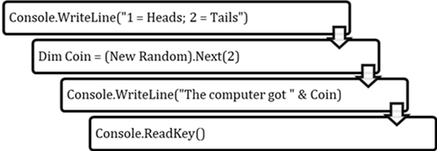
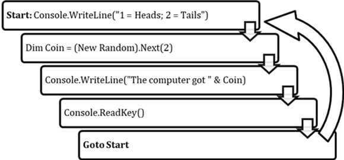

# 3.1 Control Flow

## Control Flow
```vb
Console.WriteLine("1 = Heads; 2 = Tails")
Dim Coin = (New Random).Next(2)
Console.WriteLine("The computer got " & Coin)
Console.ReadKey()
```

A computer program is made up of a sequence of statements. The order in which each statement is run is called the **control flow**, with control of the computer flowing from one statement to another. Normally, programs use **sequential control flow**, where control flows from one statement to the next one in sequence. However, it is common in many algorithms to want to repeat or skip statements under certain circumstances--to change the control flow. To do this, we will use control flow statements and control structures.

## The ```Goto``` Statement
The simplest way to change the control flow of a program is by using the ```Goto``` statement. This statement, also known as an **unconditional branch**, moves control of the program to a place we specify.

To use a ```Goto``` statement requires two things. First, at the place where you want to go, place a **label** - a name followed by a colon (```:```). Then, at the place where you are going from, place the ```Goto``` statement - the keyword ```Goto``` followed by the name from your label. You can go to the same label from multiple places in your program if you so choose.

### Example
```vb
Start: Console.WriteLine("1 = Heads; 2 = Tails")
Dim Coin = (New Random).Next(2)
Console.WriteLine("The computer got " & Coin)
Console.ReadKey()
Goto Start
```


At the beginning of this program is placed a label named "Start". When the program runs, it goes down through the program in sequential order until it reaches the Goto statement at the end. This statement causes the program to go back to the beginning, where the "Start" label is placed. Then, sequential control flow takes over again, going down through the program again. Since whenever the program reaches the bottom the Goto statement makes it go back to the top, the program never stops. We will take a closer look at such infinite loops in an upcoming lesson.

### Controversy over the Goto Statement
The Goto statement is one of the primitive control flow statements on which the other structures are built, but its direct usage in high-level programs has been increasingly discouraged due to poor programming practices leading to confusing "spaghetti code". If your program uses Goto statements to move back and forth around the code, it can become increasingly difficult to keep track of the order in which everything is supposed to happen, and, as a result, what the program is supposed to be doing.
* The most well-known letter on this subject is "Go To Statement Considered Harmful" written by Edgser W. Dijkstra and published in March 1968 (Here is a link to a transcript of the letter under its original title "A Case against the GO TO Statement" http://www.cs.utexas.edu/users/EWD/transcriptions/EWD02xx/EWD215.html)

Some programming languages today have removed the ```Goto``` statement in favor of **control structures**, which provide more of a building-block approach to control flow that is easier to keep track of. Visual Basic keeps its ```Goto``` statement for historical reasons, but also includes control structures, which we will be using almost exclusively starting with the next lesson.

## Question
1. Look back at the [searching and sorting algorithms](../Unit1/2_SearchSort.md) from Unit 1, and describe places where they changed the control flow away from sequential.